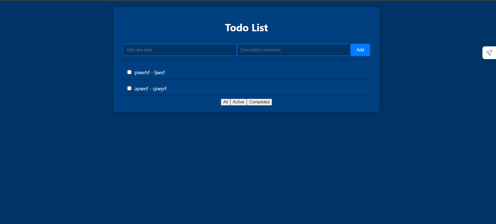
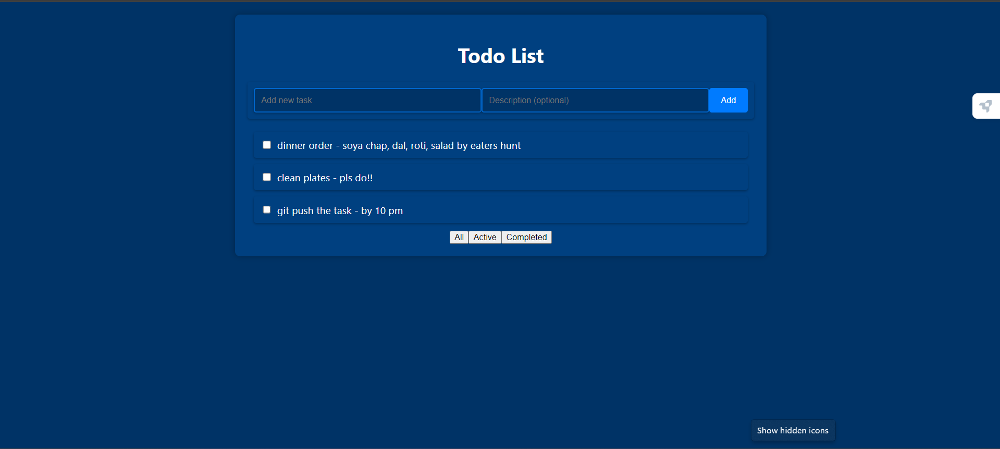
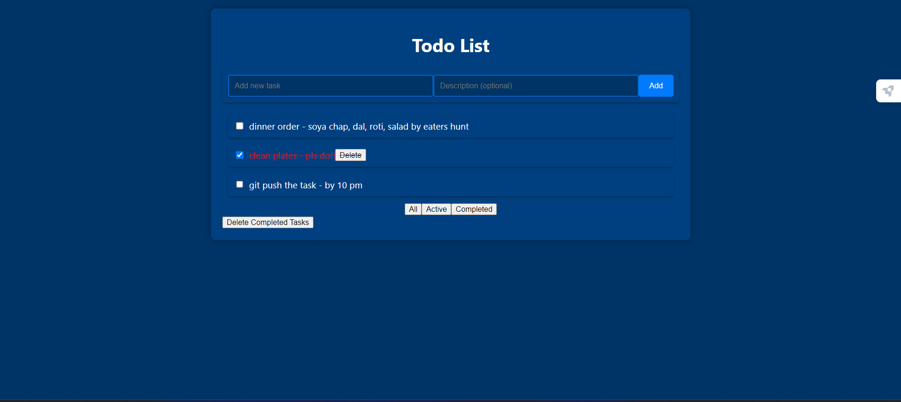

# Getting Started with Create React App

This project was created as assignment for the NapQueen company by drishti sachan was completed in approx 2hrs. 

In the project directory, you can run:

### `npm start`

Runs the app in the development mode.\
Open [http://localhost:3000](http://localhost:3000) to view it in the browser.

The page that is loaded is 

After this we can add the task as well as the description for the task if needed.
and the task are shown below 

After completing of this task we can strike out the tasks.

In this we can leave the task as it is or select more
The after completion of all task can delete by using the DELETE COMPLETED TASKS

